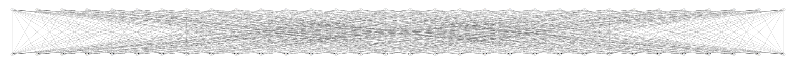
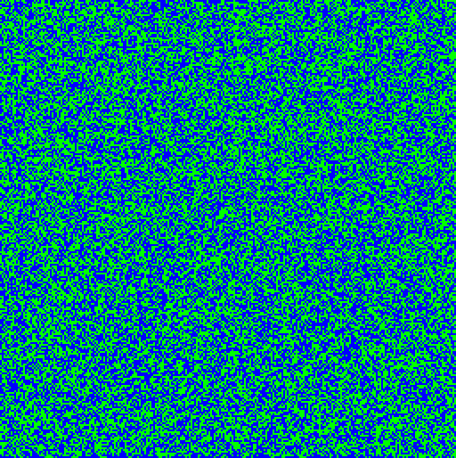

# ↻ There and Back Again ↺

There is this [Nintendo game](challenge/hello.cpp) that takes an input string, does something, and then spits out an output string. That is all it does! The objective of the game is to figure out how to reverse the process, and it turns out to be quite fun!

Here is an example of an input value (in hex) that leads to the output string "Hello, World!":
```
$ make example
a728ecdd3663964c88884c193636f2967d074c19dd88dd3688ddf2ddb9c3eca7 Hello, World!   
```


### SP-network
The game takes a 32 byte input string and applies substitution and permutation operations to it 256 times. The substitution box maps each of the 32 bytes from a set of 256 values to a set of 240 values.
The permutation is done by XOR'ing the 32 bytes in a specific pattern that is illustrated below:



### One-way compression
The last part of the game "compresses" 32 bytes into a final 16 byte output. The SP-network & one-way compression can be seen as a simple hash function, and it is not immediately obvious how to reverse the process.

### Visualizing the internal state of a single game play
 The top line in this animation represents a 32 byte input string. Each pixel in the line corresponds to a bit in the 32 bytes. The following 256 lines (rows of pixels) represents temporary values being passed through the SP-network. The bottom line represents the 32 bytes that are passed through the one-way compression function resulting in a 16 byte output string.


## Level 1: Finding solutions
This solution generator works its way backwards up through the one-way compression & SP-network.

In this example, the solution generator (reverse.py) finds 8 input strings that all leads to the output string "Hello there!!!!!". The input strings are passed into an implementation of the game (forward.py) which prints input-output strings pairwise for visual verification. At first sight, some of the input strings may look like duplicates, but they are all unique:

```
$ tools/reverse.py 8 "Hello there!!!!!" | tools/forward.py | sort | uniq | cat -n
     1	24150ff7d529334b45a8ea13cb2a997bef2b2cb72b179fda52cc7a85492b3fbc Hello there!!!!!
     2	24150ff7d5b5334b45a8ea13cb2a997bef2b2cb72b179fda52cc7a85492b3fbc Hello there!!!!!
     3	24970ff7d529334b45a8ea13cb2a997bef2b2cb72b179fda52cc7a85492b3fbc Hello there!!!!!
     4	24970ff7d5b5334b45a8ea13cb2a997bef2b2cb72b179fda52cc7a85492b3fbc Hello there!!!!!
     5	338dd8a345b898fc66c0ccbabdc12b68fd7321f4d5f0c6fd50ba1ef4b97aa2bd Hello there!!!!!
     6	338dd8a345cf98fc66c0ccbabdc12b68fd7321f4d5f0c6fd50ba1ef4b97aa2bd Hello there!!!!!
     7	7c150ff7d529334b45a8ea13cb2a997bef2b2cb72b179fda52cc7a85492b3fbc Hello there!!!!!
     8	7c150ff7d5b5334b45a8ea13cb2a997bef2b2cb72b179fda52cc7a85492b3fbc Hello there!!!!!
```

The solution generator is single-threaded and implemented with Python generators. Given enough time it will eventually find all valid input strings for any given output string. It takes a moment before the first solution is found, so it is not a level3 solution generator.

Running the code with [PyPy](https://www.pypy.org/) on a dusty iMac:

```
$ make perftest
8192 solutions found in 5.62s, on average 0.69ms per solution.
8192 solutions found in 4.18s, on average 0.51ms per solution.
8192 solutions found in 4.39s, on average 0.54ms per solution.
8192 solutions found in 3.61s, on average 0.44ms per solution.
```


### Animation of many games leading to the same result
Each frame represents the internal state of an entire game play. Notice how only the top part appears to change? This is because the animation contains only a tiny subset of all possible input values that leads to the same result.




## Level 2: Lightning fast
This solution generator will only find a single solution but it will always find a solution, and it will do so at lightning speed. Here it finds an input value that leads to the output string "Game of riddles":
```
$ tools/reverse-level2.py "Game of riddles" | tools/forward.py
6396f2f2a7f263f2b93619f2dddd636307287d19dd7db9dd19ecdd4cf2dd7da7 Game of riddles
```

This solution was generated instantly. Spoiler alert: sbox.svg and https://tlk.github.io/nsg/.
