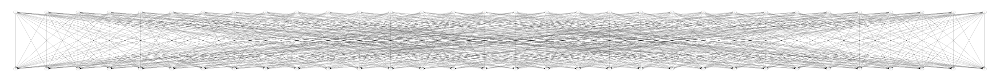

↻ Nintendo Forward Solution Generator ↺
=======================================

This is a solution generator for the Nintendo Forward game.

Single-threaded and implemented with Python generators.

Example
-------
```
$ make solutions
python3 example/solutions.py
00000000 0x4d,0x79,0x84,0xe3,0xdd,0xaf,0x93,0xd7,0x8e,0xa7,0x6f,0x8c,0xa0,0xc1,0x46,0x5f,0xdb,0x60,0x65,0x01,0x6b,0x19,0xe9,0xd2,0xce,0xff,0x50,0xad,0xca,0x9c,0x85,0xd4 	 Hello there!!!!
00000001 0x4d,0x79,0x84,0xe3,0xdd,0xaf,0x93,0xd7,0x8e,0xa7,0xed,0x8c,0xa0,0xc1,0x46,0x5f,0xdb,0x60,0x65,0x01,0x6b,0x19,0xe9,0xd2,0xce,0xff,0x50,0xad,0xca,0x9c,0x85,0xd4 	 Hello there!!!!
00000002 0x4d,0x79,0xdc,0xe3,0xdd,0xaf,0x93,0xd7,0x8e,0xa7,0x6f,0x8c,0xa0,0xc1,0x46,0x5f,0xdb,0x60,0x65,0x01,0x6b,0x19,0xe9,0xd2,0xce,0xff,0x50,0xad,0xca,0x9c,0x85,0xd4 	 Hello there!!!!
00000003 0x4d,0x79,0xdc,0xe3,0xdd,0xaf,0x93,0xd7,0x8e,0xa7,0xed,0x8c,0xa0,0xc1,0x46,0x5f,0xdb,0x60,0x65,0x01,0x6b,0x19,0xe9,0xd2,0xce,0xff,0x50,0xad,0xca,0x9c,0x85,0xd4 	 Hello there!!!!
00000004 0xd1,0x79,0x84,0xe3,0xdd,0xaf,0x93,0xd7,0x8e,0xa7,0x6f,0x8c,0xa0,0xc1,0x46,0x5f,0xdb,0x60,0x65,0x01,0x6b,0x19,0xe9,0xd2,0xce,0xff,0x50,0xad,0xca,0x9c,0x85,0xd4 	 Hello there!!!!
00000005 0xd1,0x79,0x84,0xe3,0xdd,0xaf,0x93,0xd7,0x8e,0xa7,0xed,0x8c,0xa0,0xc1,0x46,0x5f,0xdb,0x60,0x65,0x01,0x6b,0x19,0xe9,0xd2,0xce,0xff,0x50,0xad,0xca,0x9c,0x85,0xd4 	 Hello there!!!!
00000006 0xd1,0x79,0xdc,0xe3,0xdd,0xaf,0x93,0xd7,0x8e,0xa7,0x6f,0x8c,0xa0,0xc1,0x46,0x5f,0xdb,0x60,0x65,0x01,0x6b,0x19,0xe9,0xd2,0xce,0xff,0x50,0xad,0xca,0x9c,0x85,0xd4 	 Hello there!!!!
00000007 0xd1,0x79,0xdc,0xe3,0xdd,0xaf,0x93,0xd7,0x8e,0xa7,0xed,0x8c,0xa0,0xc1,0x46,0x5f,0xdb,0x60,0x65,0x01,0x6b,0x19,0xe9,0xd2,0xce,0xff,0x50,0xad,0xca,0x9c,0x85,0xd4 	 Hello there!!!!
00000008 0x62,0x9d,0x8b,0x04,0x1e,0xbd,0xbc,0xbd,0x1c,0x65,0x61,0xa1,0x2a,0xc1,0xf6,0x9b,0x92,0x7f,0xd0,0x46,0x3c,0x0c,0x45,0x00,0x25,0x7b,0x9d,0x64,0x11,0xea,0x60,0x4a 	 Hello there!!!!
00000009 0xfe,0x9d,0x8b,0x04,0x1e,0xbd,0xbc,0xbd,0x1c,0x65,0x61,0xa1,0x2a,0xc1,0xf6,0x9b,0x92,0x7f,0xd0,0x46,0x3c,0x0c,0x45,0x00,0x25,0x7b,0x9d,0x64,0x11,0xea,0x60,0x4a 	 Hello there!!!!
```

Animation of a 256 round forward bitstream
------------------------------------------


Permutation box illustrated
---------------------------

